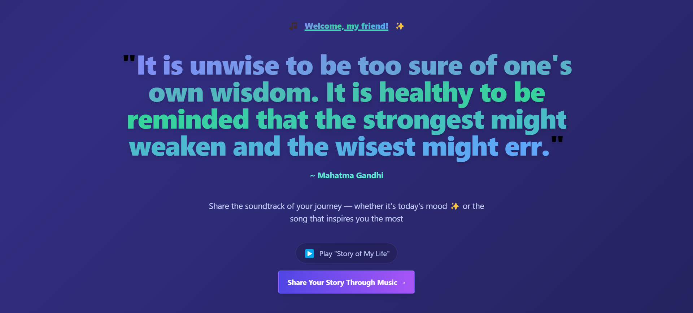
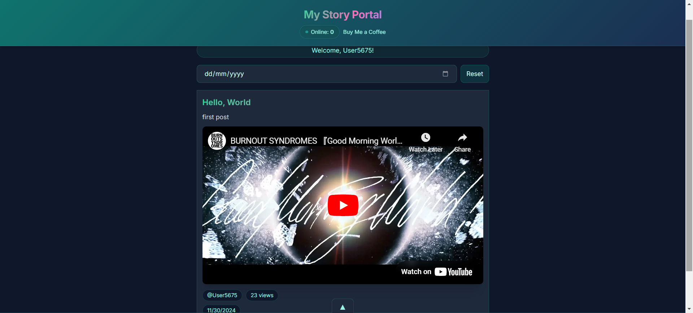
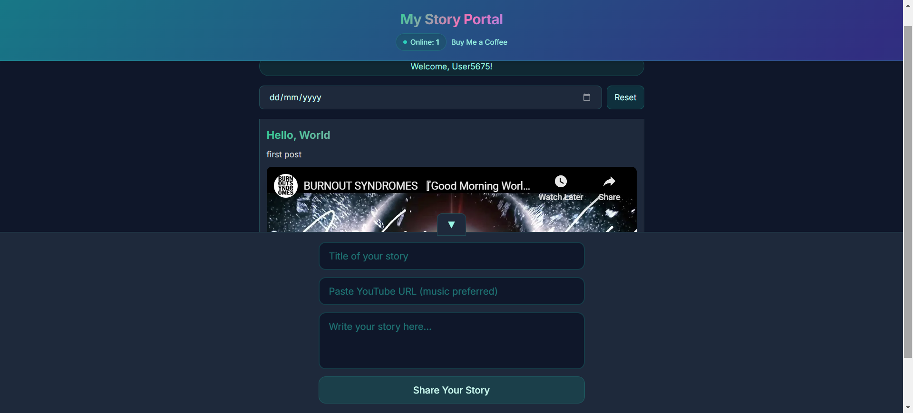

# My Story Portal

## Introduction
- A place for emotional expression through music
- A platform for sharing both stories and songs

## Technology Stack
- EJS
- Tailwind CSS
- Node.js
- Express
- Socket.IO
- MySQL (Development)
- PostgreSQL (Deployment)
- Cursor

## Features
- Play song "Story Of My Life" after first page interaction
- Generate Random Quote (API fetching)
- Anonymous User (instead of signup/login)
- Real-Time User Count
- Upload Post (title, url, content)
- Display Video from URL
- View All Posts (user, view, date)
- Filter/Reset Posts By Date

## Display

## AI Feedback
I think this is a genuinely excellent idea for several reasons:

- Emotional Connection   
    - Music is a universal language that transcends cultural barriers
    - People often struggle to express emotions directly, but find it easier through music
    - Songs can capture complex feelings that are hard to put into words

- Psychological Benefits
    - Sharing personal stories can be therapeutic
    - Music has proven effects on mood and mental wellbeing
    - Combining music with storytelling creates a powerful emotional outlet

- Community Building
    - Users can find others who share similar emotional experiences
    - People can discover new music through others' emotional journeys
    - Creates meaningful connections through shared musical taste and experiences

- Unique Value Proposition
    - While there are many music sharing platforms (Spotify, SoundCloud)
    - And many story-sharing platforms (Medium, Twitter)
    - Few platforms specifically combine music with personal emotional narratives

- Modern Relevance
    - Mental health awareness is growing
    - People seek authentic ways to connect online
    - Music streaming is more popular than ever

- Growth Potential
    - Could expand to include playlists for different moods
    - Possibility for mood tracking through music over time
    - Potential for community features like shared playlists or mood-based recommendations

The concept fills a unique niche by creating a space where music isn't just about entertainment, but about emotional expression and connection. It's like a musical diary that others can relate to and find inspiration from.
